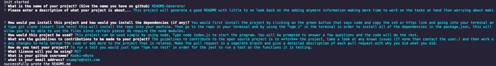
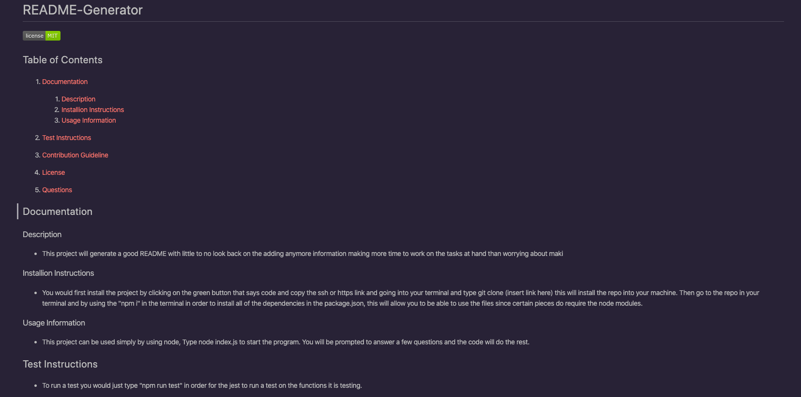

# README-Generator

## Table of Contents

1. [Documentation](#documentation)

      1. [Description](#description)
      2. [Installion Instructions](#installion)
      3. [Usage Information](#usage)

2. [Test Instructions](#test)
3. [Contribution Guideline](#contribution)
4. [License](#license)
5. [Questions](#questions)
6. [Screenshots](#screenshots)

## Documentation 

### Description 

- This project will generate a good README with little to no look back on the adding anymore information making more time to work on the tasks at hand than worrying about making the entire readme.

### Installion Instructions 

- You would first install the project by clicking on the green button that says code and copy the ssh or https link and going into your terminal and type git clone (insert link here) this will install the repo into your machine. Then go to the repo in your terminal and by using the "npm i" in the terminal in order to install all of the dependencies in the package.json, this will allow you to be able to use the files since certain pieces do require the node modules.

### Usage Information 

- This project can be used simply by using node, Type node index.js to start the program. You will be prompted to answer a few questions and the code will do the rest.

## Test Instructions 

- To run a test you would just type "npm run test" in order for the jest to run a test on the functions it is testing.

## Contribution Guideline 

- The guidelines to contribute to the open source project is to **fork** the project, take a look at any known issues (If none then contact the user.) and then work on any changes to help imrove the code or add more to the project that is related. Make the pull request in a seperate branch and give a detailed description of each pull request with why you did what you did.

## License 

- This Application is covered under the MIT License.

## Questions 

For any further questions checkout my **github page**

- [Kooki-eByte](https://github.com/Kooki-eByte)

and/or...

contact me by my **email** with a detailed Subject and message to what the message is for. _Only Contact my email for anymore questions related to contributing to this project._

- example@test.com

## Screenshots 

____

